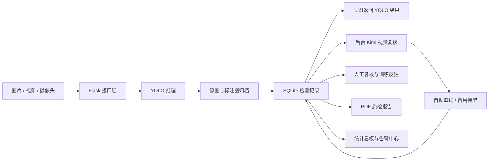

# WeldSight-YOLO：焊缝缺陷智能检测与复核平台

WeldSight-YOLO 是一个面向焊缝射线底片质检场景的本地 Web 应用。系统以 YOLO
目标检测模型为第一层视觉分析引擎，对图片、视频和摄像头画面中的候选缺陷进行定位、
分类与置信度计算；随后可调用 Moonshot Kimi 视觉模型，对原始底片与 YOLO 标注结果
进行第二次语义复核。检测结果会被持久化保存，并进入人工复核、报告归档、训练反馈和
数据统计流程。

本项目不只是一个“上传图片并返回检测框”的演示程序，而是一套完整的质检工作台：
它能够保留原图和标注图，记录模型版本与处理状态，处理 Kimi 429 过载等异常，生成
可打印的 PDF 报告，并允许复核人员修正误报、漏报和缺陷类别。项目适合用于课程设计、
毕业设计、算法演示、工业质检原型验证和焊缝缺陷数据闭环研究。

> 重要说明：系统输出属于算法辅助筛查结果，不能替代持证无损检测人员依据适用标准作出
> 的最终评定。生产使用前应完成模型验证、权限控制、数据备份和组织内部合规审查。

## 一、项目亮点

- **YOLO 与视觉大模型协同**：YOLO 负责高效定位候选框，Kimi 负责结合原图、标注图和
  候选信息进行语义复核，两类模型职责清晰。
- **检测结果优先返回**：单图上传后先完成 YOLO 推理并保存记录，不必等待 Kimi。即使
  Kimi 超时、过载或不可用，用户仍然能够查看检测图和候选缺陷。
- **AI 自动重试和模型降级**：Kimi 遇到 429、连接失败、超时或服务端临时错误时，按
  指数退避策略重试；主模型连续失败后，可依次切换备用视觉模型。
- **完整检测历史**：原始图片、检测图片、检测时间、来源、置信度阈值、YOLO 版本、
  AI 状态、人工结论和处置意见统一归档。
- **批量任务队列**：一次选择多张底片，后台逐张检测，页面展示总进度、成功数、失败数
  和单张状态，并可下载批次汇总报告。
- **人工复核闭环**：复核人员可以确认正确、标记误报、登记漏报、修改类别并填写处置
  意见。修正内容同时写入训练反馈文件，便于后续数据清洗和模型再训练。
- **正式 PDF 报告**：报告包含项目名称、检测单位、检测编号、时间、模型、阈值、缺陷
  截图、置信度、AI 结论、人工复核人与免责声明，可直接打印或归档。
- **实时告警归档**：摄像头检测到候选缺陷后自动保存原始帧和标注帧；告警冷却机制可以
  避免同一异常在短时间内被重复记录。
- **统计看板**：展示检测记录数、缺陷记录率、候选框总数、平均置信度、类别分布和每日
  趋势，数据直接来自本地检测历史。
- **统一响应式界面**：首页、单图、批量、视频、摄像头、历史、看板和设置页使用统一
  设计语言，同时支持桌面端和移动端浏览。

## 二、系统架构

系统采用 Flask 单体应用结构，前端使用原生 HTML、CSS 和 JavaScript，后端负责模型
推理、任务编排、文件存储、SQLite 数据访问、PDF 生成以及 Kimi API 调用。该结构部署
简单，便于教学和二次开发，也能清楚展示从模型推理到业务归档的完整链路。



核心模块职责如下：

| 模块 | 主要职责 |
|---|---|
| `inference.py` | 统一执行 YOLO 推理，返回标注图和可序列化的候选框数据 |
| `ai_reviewer.py` | 构造 Kimi 多模态请求，处理 JSON 输出、重试和备用模型 |
| `inspection_service.py` | 编排单图、批量任务、文件保存和后台 AI 复核 |
| `inspection_store.py` | 管理 SQLite 表、搜索筛选、统计、人工复核和训练反馈 |
| `pdf_reports.py` | 生成单条质检报告和批次汇总报告 |
| `camera_handler.py` | 处理摄像头循环、MJPEG 帧、检测状态和告警冷却 |
| `video_processor.py` | 异步逐帧处理视频并维护任务进度 |
| `routes/` | 暴露页面、检测、历史、批量、设置、报告和设备接口 |

## 三、功能页面

启动后访问 `http://127.0.0.1:5098/`，可从统一侧栏进入以下模块：

| 页面 | 地址 | 功能 |
|---|---|---|
| 工作台首页 | `/` | 展示系统定位、检测入口和管理入口 |
| 图片检测 | `/img.html` | 单图上传、YOLO 检测、交互框、AI 复核和 PDF 下载 |
| 批量图片检测 | `/batch.html` | 多图选择、队列状态、总体进度和批次报告 |
| 视频检测 | `/vid.html` | 上传视频、异步逐帧分析、查看进度和下载处理视频 |
| 实时检测 | `/cam.html` | 选择摄像头、启动检测、声音提醒和告警记录 |
| 检测历史 | `/history.html` | 搜索筛选、查看原图/标注图、AI 重审和人工复核 |
| 数据看板 | `/dashboard.html` | 查看核心指标、类别分布、趋势和近期记录 |
| 系统设置 | `/settings.html` | 配置阈值、模型、重试、摄像头和报告单位 |

### 3.1 图片检测与交互框

图片检测支持 PNG、JPEG 和 WebP。图片载入后可先预览原图，点击“开始检测并复核”
即可创建一条持久化检测记录。页面会优先显示 YOLO 结果，随后轮询后台 AI 状态。

原图视图会根据图片实际尺寸与页面画布尺寸重新计算候选框位置。用户可以单击检测框查看
类别、置信度和坐标；也可以按类别隐藏候选框、调节显示阈值，或完全关闭交互标注。切换
到检测图时，可查看 YOLO 生成的固定标注图片。显示阈值只控制前端可见候选框，检测时
提交的阈值则会影响模型实际输出。

### 3.2 检测历史中心

历史中心保存所有单图、批量图片和摄像头告警记录。搜索框可以匹配文件名、项目名称、
缺陷类别和检测编号；筛选项支持来源、AI 状态和人工结论。点击记录后，右侧详情面板
展示原图、标注图、模型版本、阈值、候选缺陷、AI 摘要和综合结论。

如果 AI 复核失败或暂时未配置，可以点击“重新 AI 复核”再次进入后台队列。人工复核区
支持逐框确认、误报标记和类别修改，还可额外登记漏检类型。保存后，记录状态会更新为
已复核，同时将模型输出和人工修正写入 `training_feedback.jsonl`。

### 3.3 批量图片检测

批量页面一次最多接收 `BATCH_MAX_IMAGES` 张图片，默认值为 50。提交后后端创建批次
记录，并在守护线程中依次处理每张图片。批次进度包含总数、已处理数、完成数、失败数
和记录 ID。YOLO 完成并不要求所有 Kimi 任务同步结束，因此页面可以尽早给出批次结果，
AI 状态会继续在各检测记录中更新。

批次完成后可以进入历史中心查看单张明细，也可以直接下载汇总 PDF。汇总报告包含批次
名称、样本总数、成功/失败数、候选缺陷总数、类别分布和各样本处理状态。

### 3.4 人工复核与训练反馈

人工复核不是简单的“同意/拒绝”按钮，而是一个可积累监督信息的数据入口。支持的总体
结论包括结果接受、确认缺陷、确认误报、确认漏报和混合结论。每个 YOLO 候选框还可以
单独设置为确认正确、误报或修改类别。

训练反馈采用 JSON Lines 格式，每行代表一次人工复核事件，包含检测编号、原始文件、
模型候选框、人工结论、修正类别、漏检登记、复核人和处置意见。该文件可作为后续标注
平台导入、困难样本抽取或主动学习流程的数据来源，但它不会自动修改当前 YOLO 权重。

### 3.5 实时摄像头告警

实时检测使用 OpenCV 打开本地摄像头，并通过 MJPEG 将最新标注帧传到浏览器。后端
循环持续更新候选框、检测时间和错误状态。当画面出现候选缺陷时，系统保存原始帧与标注
帧，并将其作为 `camera` 来源的检测记录写入历史中心。

`ALERT_COOLDOWN_SECONDS` 控制告警冷却时间。冷却期内即使连续帧都检测到缺陷，也不会
反复生成归档记录。页面只对新的告警 ID 触发声音和视觉提示，从而降低重复报警对操作
人员的干扰。

### 3.6 统计看板

统计接口按最近 7、30、90 天等时间窗口读取 SQLite 数据。看板中的“缺陷记录率”表示
至少包含一个候选缺陷的检测记录占全部记录的比例，不等同于最终质量不合格率。平均
置信度由窗口内全部候选框计算，类别分布统计候选框数量，每日趋势同时展示检测记录数和
候选缺陷数。

## 四、运行环境与依赖

推荐环境：

- Windows 10/11 或支持 Python、OpenCV 的 Linux 系统；
- Python 3.12 及以上；
- 建议 8 GB 以上内存；
- 可选 NVIDIA GPU 与匹配的 CUDA/PyTorch 环境；
- Google Chrome、Edge 或其他现代浏览器；
- 使用实时模块时需要可被 OpenCV 访问的摄像头；
- 使用 AI 复核时需要可用的 Moonshot API Key 和网络连接。

主要 Python 依赖包括 Flask、Ultralytics、PyTorch、OpenCV、Pillow、NumPy、
OpenAI Python SDK、Matplotlib、SciPy 和 python-dotenv。完整版本约束以
`pyproject.toml` 和 `uv.lock` 为准。

## 五、安装与启动

### 5.1 获取代码

```powershell
git clone git@github.com:AaaBinfinity/WeldSight-YOLO.git
cd WeldSight-YOLO
```

YOLO 权重文件通常较大，项目通过 `.gitignore` 忽略 `*.pt`、`*.onnx` 等文件。请将
训练好的权重放到项目中，例如 `v-app/best_v8.pt`，或在 `.env` 中配置绝对路径。

### 5.2 使用 uv 安装（推荐）

```powershell
uv sync
```

`uv sync` 会根据 `pyproject.toml` 和锁文件创建 `.venv` 并安装依赖。如果 PyTorch
需要特定 CUDA 版本，请先参考 PyTorch 官方安装方式配置对应轮子，再执行其余依赖同步。

### 5.3 使用传统虚拟环境

```powershell
py -3.12 -m venv .venv
.\.venv\Scripts\Activate.ps1
python -m pip install --upgrade pip
pip install -e .
```

如果 PowerShell 阻止激活脚本，可在当前用户范围调整执行策略，或直接使用
`.\.venv\Scripts\python.exe` 运行命令。

### 5.4 创建 `.env`

```powershell
Copy-Item .env.example .env
```

编辑根目录 `.env`，至少确认 YOLO 权重路径。需要 Kimi 复核时再填写新生成的 API Key：

```dotenv
MOONSHOT_API_KEY=在这里填写你的_API_Key
KIMI_VISION_MODEL=kimi-k3
KIMI_FALLBACK_MODELS=moonshot-v1-32k-vision-preview,kimi-k2.6
KIMI_REVIEW_ENABLED=true

YOLO_MODEL_PATH=v-app/best_v8.pt
CONF_THRESH=0.25
FLASK_SECRET_KEY=请替换为随机字符串
```

不要把真实 Key 写入 Python、HTML、截图、README 或提交记录。`.env` 已被 Git 忽略，
但如果 Key 曾发送到聊天、工单或公开仓库，仍建议立即在 Moonshot 控制台中撤销并重建。

### 5.5 启动服务

```powershell
.\.venv\Scripts\python.exe .\v-app\run.py
```

看到模型加载成功以及 Flask 监听信息后，访问：

```text
http://127.0.0.1:5098/
```

也可以使用以下接口快速检查服务：

```powershell
Invoke-RestMethod http://127.0.0.1:5098/service_status
Invoke-RestMethod http://127.0.0.1:5098/api/settings
```

`/api/settings` 只返回 `api_key_configured` 布尔状态，不会把完整 API Key 返回给前端。

## 六、环境变量说明

| 变量 | 默认值 | 说明 |
|---|---|---|
| `MOONSHOT_API_KEY` | 空 | Moonshot API Key；为空时保留 YOLO 结果并跳过 AI |
| `KIMI_REVIEW_ENABLED` | `true` | 是否启用 Kimi 视觉复核 |
| `KIMI_VISION_MODEL` | `kimi-k3` | 主视觉模型 |
| `KIMI_FALLBACK_MODELS` | 视觉模型列表 | 主模型失败后依次尝试，使用英文逗号分隔 |
| `KIMI_BASE_URL` | `https://api.moonshot.cn/v1` | Moonshot OpenAI 兼容接口地址 |
| `KIMI_TIMEOUT_SECONDS` | `60` | 单次 AI 请求超时时间 |
| `KIMI_MAX_RETRIES` | `2` | 每个模型遇到临时错误时的最大尝试次数 |
| `KIMI_RETRY_BASE_SECONDS` | `1` | 指数退避的基础等待秒数 |
| `YOLO_MODEL_PATH` | `v-app/best_v8.pt` | YOLO 权重路径，可使用绝对路径 |
| `YOLO_MODEL_VERSION` | `YOLOv11` | 写入报告和历史记录的模型版本说明 |
| `CONF_THRESH` | `0.25` | 默认检测置信度阈值，允许范围 0.05～0.95 |
| `CAMERA_DEFAULT_INDEX` | `0` | 默认摄像头索引 |
| `ALERT_COOLDOWN_SECONDS` | `8` | 实时告警归档冷却时间 |
| `BATCH_MAX_IMAGES` | `50` | 单个批量任务最大图片数 |
| `VIDEO_MAX_PROGRESS_CACHE` | `30` | 内存中保留的视频进度记录数量 |
| `WELDSIGHT_PROJECT_NAME` | `焊缝质量检测` | 报告默认项目名称 |
| `WELDSIGHT_ORGANIZATION` | 空 | 报告中的检测单位 |
| `WELDSIGHT_DEFAULT_REVIEWER` | 空 | 默认复核人 |
| `WELDSIGHT_DATA_FOLDER` | `v-app/data` | 本地业务数据目录 |
| `WELDSIGHT_DATABASE_PATH` | `v-app/data/weldsight.db` | SQLite 数据库位置 |
| `WELDSIGHT_RECORD_FOLDER` | `v-app/data/records` | 原图和标注图归档目录 |
| `WELDSIGHT_BATCH_FOLDER` | `v-app/data/batches` | 批量上传临时目录 |
| `FLASK_SECRET_KEY` | 开发值 | Flask 密钥，部署时必须替换 |

系统设置页修改的是 SQLite 中的运行时设置。数据库设置会覆盖相同项目的默认环境变量，
并在保存后重新应用到当前进程。API Key 本身只能通过服务器环境或 `.env` 配置。

## 七、Kimi 视觉复核与 429 降级机制

视觉请求使用 OpenAI 兼容 SDK，`message.content` 保持标准多模态数组结构：第一部分
为原始 JPEG 的 base64 `image_url`，第二部分为 YOLO 标注图，第三部分为包含候选框
JSON 的文字指令。系统要求模型输出 JSON 对象，并将结果规范化为总体判断、风险等级、
确认发现、疑似误报、可能漏检、图像质量、处置建议和摘要。

以下错误被视为临时错误：HTTP 429、连接失败、请求超时和服务端内部错误。单个模型的
第 `n` 次重试等待时间约为：

```text
KIMI_RETRY_BASE_SECONDS × 2^(n-1)
```

当主模型达到最大重试次数仍失败时，系统继续尝试 `KIMI_FALLBACK_MODELS`。所有模型均
不可用时，记录会进入 `ai_failed` 状态，但原图、标注图、YOLO 候选框和初步结论不会
丢失。用户可以在历史中心稍后重新复核。

这种设计将“目标检测是否成功”和“AI 语义复核是否成功”拆开，解决了过去 Kimi 过载
导致整个页面长时间无结果的问题。生产环境仍建议增加独立任务队列、集中日志和失败任务
告警，以便在服务重启后继续执行未完成任务。

## 八、数据目录与持久化

默认数据结构如下：

```text
v-app/data/
├─ weldsight.db
├─ training_feedback.jsonl
├─ records/
│  └─ <inspection-id>/
│     ├─ original.jpg
│     └─ annotated.jpg
└─ batches/
   └─ <batch-id>/
      ├─ 0000.jpg
      └─ 0001.jpg
```

SQLite 使用 WAL 模式，主要包含三张表：

- `inspections`：检测编号、时间、来源、批次、处理状态、模型、阈值、图片路径、尺寸、
  候选框、类别统计、AI 结果、综合结论和人工复核内容；
- `batches`：批次名称、总数、已处理数、成功数、失败数和关联记录 ID；
- `settings`：系统设置键值及更新时间。

`v-app/data/` 默认被 Git 忽略，适合本地运行，但不等于已经完成备份。正式使用时应同步
备份数据库与 `records` 目录，否则只有数据库而没有图片，历史详情和 PDF 将无法完整
恢复。迁移时必须保持数据库和文件目录的一致性。

## 九、主要 API

### 9.1 检测、历史和人工复核

| 方法 | 路径 | 说明 |
|---|---|---|
| `POST` | `/api/inspections` | 上传单图、执行 YOLO、保存记录并提交 AI |
| `GET` | `/api/inspections` | 搜索、筛选和分页读取检测历史 |
| `GET` | `/api/inspections/<id>` | 获取完整记录与报告 |
| `GET` | `/api/inspections/<id>/original` | 获取归档原图 |
| `GET` | `/api/inspections/<id>/annotated` | 获取归档标注图 |
| `POST` | `/api/inspections/<id>/re-review` | 重新提交 Kimi 复核 |
| `POST` | `/api/inspections/<id>/human-review` | 保存人工结论和训练反馈 |
| `GET` | `/api/inspections/<id>/pdf` | 下载单条质检 PDF |

单图上传示例：

```powershell
curl.exe -X POST `
  -F "image=@test/img1.jpg" `
  -F "project_name=A 区焊缝抽检" `
  -F "reviewer=张工" `
  -F "confidence_threshold=0.25" `
  http://127.0.0.1:5098/api/inspections
```

历史查询支持 `q`、`source_type`、`status`、`ai_status`、`review_decision`、
`batch_id`、`limit` 和 `offset`。例如：

```text
GET /api/inspections?q=气孔&source_type=batch&ai_status=completed&limit=20
```

人工复核请求示例：

```json
{
  "decision": "confirmed",
  "reviewer": "张工",
  "notes": "建议返修后重新拍片。",
  "corrections": [
    {
      "detection_index": 0,
      "decision": "class_changed",
      "class_name": "未熔合"
    }
  ],
  "missed_defects": [
    {
      "suspected_type": "气孔",
      "location_description": "焊缝右侧约三分之一处"
    }
  ]
}
```

### 9.2 批量、看板、告警和设置

| 方法 | 路径 | 说明 |
|---|---|---|
| `POST` | `/api/batches` | 通过多个 `images` 字段创建批量任务 |
| `GET` | `/api/batches` | 获取最近批次 |
| `GET` | `/api/batches/<id>` | 获取批次进度和单张记录 |
| `GET` | `/api/batches/<id>/pdf` | 下载批次汇总 PDF |
| `GET` | `/api/analytics/summary?days=30` | 获取统计看板快照 |
| `GET` | `/api/alerts` | 获取最近摄像头告警 |
| `GET` | `/api/settings` | 获取脱敏系统设置和服务状态 |
| `PUT` | `/api/settings` | 更新允许修改的运行时设置 |

项目还保留了兼容接口 `/detect_image` 和 `/detect_image_report`，以及视频接口
`/upload_video`、`/video_progress`、`/download/<filename>`。新前端的单图工作流建议
优先使用 `/api/inspections`，因为它包含持久化、异步 AI、历史和 PDF 能力。

## 十、PDF 报告

单条报告默认生成两页。第一页包含机构、项目、检测编号、时间、文件、模型、阈值、
复核人、处理状态、标注图、类别统计、逐框置信度和综合结论；第二页包含 AI 状态、
风险等级、AI 摘要、确认发现、疑似误报、漏检、处置建议、人工结论和免责声明。

PDF 使用 Matplotlib 的无界面后端生成，并优先加载微软雅黑、黑体或 Noto CJK 字体。
如果 Linux 服务器生成的中文显示为方框，请安装 Noto Sans CJK 字体，并确认字体路径
可被 `matplotlib.font_manager` 发现。

## 十一、测试与验收

运行全部单元测试：

```powershell
.\.venv\Scripts\python.exe -m unittest discover -s test -p "test_*.py" -v
```

当前测试覆盖：

- 未配置 API Key 时的安全降级；
- Kimi 请求是否使用标准多模态数组；
- 超时后的指数退避重试；
- 429 `engine_overloaded_error` 后的自动重试；
- YOLO 报告统计与兜底结论；
- SQLite 检测记录、搜索、批次和统计；
- 人工复核与训练反馈写入。

建议每次修改前端后额外执行真实浏览器验证：检查页面标题、首屏内容、控制台错误、
桌面/移动端溢出，并走通“上传图片—点击检测框—保存人工复核—批量检测—查看看板”
的完整流程。

## 十二、常见问题

### 12.1 页面一直没有检测结果

先检查终端是否显示 YOLO 模型加载成功，再访问 `/api/settings` 查看
`model_loaded`。如果为 `false`，通常是权重路径错误、权重损坏或 PyTorch 环境不匹配。
确认 `YOLO_MODEL_PATH` 指向真实文件，并重新启动服务。

### 12.2 Kimi 返回 429 或 engine overloaded

429 表示远端推理引擎暂时过载，不代表本地 YOLO 失败。新工作流会先显示并保存 YOLO
结果，后台自动重试 Kimi。可以适当增加 `KIMI_MAX_RETRIES`、配置多个备用模型，或稍后
在历史中心点击重新复核。不要在浏览器中连续快速重复提交同一记录。

### 12.3 `.env` 已填写，但系统显示未配置

`.env` 必须位于项目根目录，而不是 `v-app` 目录；变量名必须是
`MOONSHOT_API_KEY`。修改后需要重启 Python 进程。还应检查 Key 前后是否包含引号、
空格或不可见字符。设置页不会显示 Key 内容，只显示是否已配置。

### 12.4 摄像头无法启动

确认浏览器已授予摄像头权限、设备未被会议软件占用，并尝试将
`CAMERA_DEFAULT_INDEX` 改为 0、1 或 2。浏览器识别到的设备顺序与 OpenCV 索引在部分
系统中可能不同。远程部署时，服务器无法直接访问访问者电脑的物理摄像头；当前实现更
适合同一台设备上的本地运行。

### 12.5 PDF 中文乱码

Windows 通常使用微软雅黑或黑体。Linux 需要安装 Noto CJK 等中文字体。安装后重启
服务。如果报告中的图片缺失，检查 `records/<id>/original.jpg` 与
`annotated.jpg` 是否仍然存在。

### 12.6 SQLite 数据库被占用

项目已在每次数据库操作后主动关闭连接，并启用 WAL 模式。如果仍出现锁定，检查是否有
多个旧 Flask 进程同时使用同一个数据库，关闭多余进程后重试。不要直接用会长期持有
写锁的数据库编辑器连接生产数据。

## 十三、安全与部署建议

当前 `v-app/run.py` 使用 Flask 开发服务器，适合本地演示，不适合作为互联网生产服务。
正式部署建议使用 Waitress、Gunicorn 或其他 WSGI 服务，并在前面配置 Nginx/HTTPS。
同时应补充登录认证、角色权限、CSRF 防护、上传大小限制、文件内容校验、访问日志、
任务队列、限流、数据库迁移和定期备份。

API Key 只应存在于服务器环境中；系统设置接口不接受也不返回完整 Key。上传的射线底片
可能属于敏感工业数据，应限制数据目录访问权限，明确保存周期，并在删除数据库记录时
同步清理图片文件。对外提供 PDF 时，也应根据检测编号和用户权限进行访问控制。

对于高并发环境，不建议继续使用进程内守护线程执行批量和 AI 任务，因为应用重启会使
未完成线程丢失。可以将任务迁移到 Celery、RQ 或其他持久化队列，将图片放入对象存储，
再使用 PostgreSQL 管理多用户与审计信息。

## 十四、项目目录

```text
WeldSight-YOLO/
├─ .env.example                 # 环境变量模板
├─ pyproject.toml               # Python 项目与依赖
├─ uv.lock                      # uv 锁文件
├─ test/                        # 单元测试和测试样本
└─ v-app/
   ├─ run.py                    # Flask 启动入口
   ├─ best_v8.pt                # 本地模型示例位置（权重不提交 Git）
   ├─ app/
   │  ├─ routes/                # Flask 路由
   │  ├─ ai_reviewer.py         # Kimi 视觉复核
   │  ├─ inspection_service.py  # 检测与任务编排
   │  ├─ inspection_store.py    # SQLite 数据层
   │  ├─ pdf_reports.py         # PDF 报告
   │  ├─ inference.py           # YOLO 推理
   │  ├─ camera_handler.py      # 摄像头循环
   │  └─ video_processor.py     # 视频处理
   ├─ static/                   # HTML、CSS、JavaScript 与静态资源
   ├─ uploads/                  # 视频输入与处理结果
   └─ data/                     # 数据库、图片归档、批次和训练反馈
```

## 十五、后续扩展方向

可继续增加用户登录与角色权限、检测标准模板、报告电子签名、告警确认、缺陷尺寸标定、
DICOM/工业底片格式支持、对象存储、PostgreSQL、消息队列、模型热切换、数据集导出、
主动学习、模型评测集、混淆矩阵和多项目权限隔离。对于生产质检，还应把算法结果与具体
工艺、材料、焊缝编号、检测标准和返修流程建立关联。

欢迎基于本项目进行二次开发。提交代码前请确保测试通过，不提交真实 API Key、客户底片、
本地数据库、模型权重和生成报告，并在修改检测结论逻辑时同步更新测试与文档。
